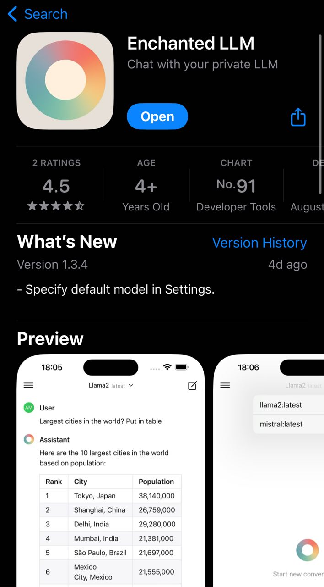
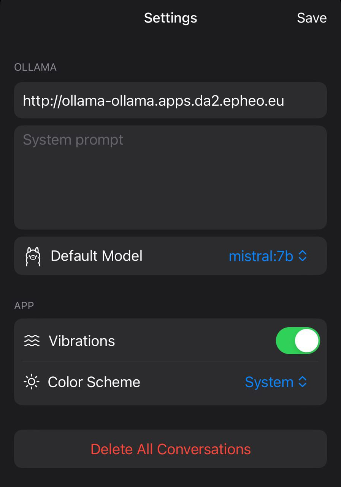

.. meta::
   :description:
      How to run your local LLM model with Ollama on your OpenShift cluster.
 
   :keywords:
      Mistral, Mistral:7b, ollama, OpenShift, LLM, GPU, AI

***********************************
Running Mistral:7b LLM on OpenShift 
***********************************

.. article-info::
    :date: Feb 05, 2024
    :read-time: 10 min read

Running your local LLM model with Ollama on your OpenShift cluster.

Introduction
============

`Ollama <https://ollama.ai/>`_ is an open-source tool that simplifies running and managing Large Language Models (LLMs) locally. It provides a simple API for managing model lifecycles and making inference requests.

.. seealso::

    https://mistral.ai/news/announcing-mistral-7b/

Mistral is a powerful Large Language Model trained by a French start-up that currently 
outperforms other models of the same size. By combining Mistral with Ollama on OpenShift, you can run a production-grade LLM environment within your own infrastructure.

All the files and configurations referenced in this article are available in the `openshift-ollama GitHub repository <https://github.com/epheo/openshift-ollama>`_.

Pre-requirements
================

This tutorial uses the following components:

* A single-node OpenShift cluster with an Nvidia RTX 3080 GPU
* OpenShift configured with the `Nvidia GPU Operator <https://docs.nvidia.com/datacenter/cloud-native/gpu-operator/latest/openshift/introduction.html>`_
* Basic familiarity with OpenShift and container concepts

.. note::
    If you don't have a GPU available, you can still follow this tutorial, but model loading and inference will be significantly slower on CPU.

Running Mistral:7B on OpenShift
================================

Architecture Overview
~~~~~~~~~~~~~~~~~~~~~

Our deployment consists of the following components:

1. An Ollama server pod with GPU access for model execution
2. Persistent storage for model weights and cache
3. Internal and external routes for API access
4. Optional integration with client applications (Telegram bot, VSCode plugins, iOS app)

Deploying Ollama
~~~~~~~~~~~~~~~~

First, we'll create the required OpenShift namespace:

Within an ollama namespace

.. literalinclude:: /articles/openshift-ollama/ollama.yaml
    :language: yaml
    :linenos:
    :lines: 2-5
    :caption: openshift-ollama.yaml 

We create the PVC and Deployment using the ollama official container image:

https://hub.docker.com/r/ollama/ollama

.. literalinclude:: /articles/openshift-ollama/ollama.yaml
    :language: yaml
    :linenos:
    :lines: 7-56
    :caption: openshift-ollama.yaml 

We notice the **nvidia.com/gpu: 1** resources parameter.

Exposing the Ollama API endpoint
~~~~~~~~~~~~~~~~~~~~~~~~~~~~~~~~

We expose the Ollama API endpoint both internally (for other containers like our Telegram Bot) and externally (for services such as VSCode plugins or mobile apps).

.. warning::

    Security note: The external endpoint in this setup is only exposed on a private network 
    accessed via VPN. Since we haven't configured authentication for this endpoint, exposing it 
    to a public IP would create a significant security risk.

.. literalinclude:: /articles/openshift-ollama/ollama.yaml
    :language: yaml
    :linenos:
    :lines: 58-87
    :caption: openshift-ollama.yaml 

Running Mistral LLM on Ollama
~~~~~~~~~~~~~~~~~~~~~~~~~~~~~

Now that our Ollama service is up and running, we can pull the Mistral:7b model using the exposed API endpoint:

.. code-block:: bash

    $ curl -X POST http://$(oc get route ollama -n ollama -ojsonpath='{.spec.host}')/api/pull -d '{"name": "mistral:7b"}'

.. note::
    Depending on your network speed and GPU capabilities, this may take several minutes as it downloads and prepares the model.

After the download is complete, we can validate that our model has been successfully loaded:

.. code-block:: bash

    $ curl -s http://$(oc get route ollama -n ollama -ojsonpath='{.spec.host}')/api/tags |jq .
    {
      "models": [
        {
          "name": "mistral:7b",
          "model": "mistral:7b",
          "modified_at": "2024-02-03T19:44:00.872177836Z",
          "size": 4109865159,
          "digest": "61e88e884507ba5e06c49b40e6226884b2a16e872382c2b44a42f2d119d804a5",
          "details": {
            "parent_model": "",
            "format": "gguf",
            "family": "llama",
            "families": [
              "llama"
            ],
            "parameter_size": "7B",
            "quantization_level": "Q4_0"
          }
        }
      ]
    }

The response contains important information:

* **format**: GGUF (GPT-Generated Unified Format) - optimized for inference
* **family**: llama - the base architecture family
* **parameter_size**: 7B - the model has 7 billion parameters
* **quantization_level**: Q4_0 - the precision level of the model weights

Creating Custom Models with Specializations
^^^^^^^^^^^^^^^^^^^^^^^^^^^^^^^^^^^^^^^^^^^

One of Ollama's powerful features is the ability to create custom models with specialized behaviors without retraining. Let's create a model specialized in OpenShift documentation:

.. code-block:: bash
 
    $ curl http://$(oc get route ollama -n ollama -ojsonpath='{.spec.host}')/api/create -d '{
      "name": "ocplibrarian",
      "modelfile": "FROM mistral:7b\nSYSTEM You are a Librarian, specialized in retrieving content from the OpenShift documentation."
    }'

This creates a new model called "ocplibrarian" that inherits all capabilities from Mistral:7b but has been given a specific persona and purpose through the SYSTEM instruction.

Exploring Alternative Models: OpenHermes 2.5 
~~~~~~~~~~~~~~~~~~~~~~~~~~~~~~~~~~~~~~~~~~~~

Mistral isn't the only model you can run on Ollama. Let's also try OpenHermes 2.5, an instruction-tuned variant of Mistral that offers improved performance on many tasks:

.. code-block:: bash

    $ curl -X POST http://$(oc get route ollama -n ollama -ojsonpath='{.spec.host}')/api/pull -d '{"name": "openhermes2.5-mistral:7b-q4_K_M"}'

After pulling the model, we can create a customized version with a specific personality:

.. code-block:: bash
 
    $ curl http://$(oc get route ollama -n ollama -ojsonpath='{.spec.host}')/api/create -d '{
      "name": "hermes2",
      "modelfile": "FROM openhermes2.5-mistral:7b-q4_K_M\nSYSTEM You are \"Hermes 2\", a conversational AI assistant developed by Teknium. Your purpose is to assist users with helpful, accurate information and engaging conversation."
    }'

The model is now available as "hermes2" and carries the specified system prompt that defines its behavior.

Interacting with the LLM
========================

Building a Telegram Bot Interface
~~~~~~~~~~~~~~~~~~~~~~~~~~~~~~~~~

For a practical demonstration of the Ollama API, let's create a simple Telegram bot that serves as an interface to our LLM. We'll call it **Tellama**.

The core functionality retrieves user messages from Telegram, forwards them to the Ollama API, and returns the LLM's responses:

.. literalinclude:: /articles/openshift-ollama/tellama/tellama.py
    :language: python
    :linenos:
    :lines: 14-31
    :caption: tellama.py

This implementation is intentionally simple and has some limitations:
- No conversation history or context is maintained between messages
- No support for streaming responses
- Limited error handling

These limitations could be addressed in a more robust implementation, but this serves as a good starting point for testing the API.

Deploying the Telegram Bot on OpenShift
^^^^^^^^^^^^^^^^^^^^^^^^^^^^^^^^^^^^^^^

Now let's containerize our Python script using a UBI (Universal Base Image) container and deploy it to our OpenShift cluster:

.. code-block:: bash
 
    # Build the container image
    cd tellama
    podman build .
    
    # Get the image ID and OpenShift registry URL
    export image_id=$(echo $(podman images --format json |jq .[0].Id) | cut -c 2-13)
    export ocp_registry=$(oc get route default-route -n openshift-image-registry -ojsonpath='{.spec.host}')
    
    # Push to the OpenShift internal registry
    podman login -u <user> -p $(oc whoami -t) ${ocp_registry}
    podman push $image_id docker://${ocp_registry}/ollama/tellama:latest

After creating a new Telegram bot messaging @botfather we create a new Secret 
containing the Telegram Token.

.. literalinclude:: /articles/openshift-ollama/example.ollama-secret.yaml
    :language: yaml
    :linenos:
    :caption: ollama-secret.yaml

We can now deploy our created image within the OpenShift cluster.
Replacing the **image:** with the value of **$ocp_registry**

.. literalinclude:: /articles/openshift-ollama/tellama.yaml
    :language: yaml
    :linenos:
    :caption: tellama.yaml

Integrating with Development Tools
~~~~~~~~~~~~~~~~~~~~~~~~~~~~~~~~~~

Developer Experience with VSCode Extensions
^^^^^^^^^^^^^^^^^^^^^^^^^^^^^^^^^^^^^^^^^^^

With our Ollama service running, we can integrate it with various development tools. Here are some VSCode extensions that work well with self-hosted LLMs:

**Continue**: A VSCode extension similar to GitHub Copilot that can leverage your self-hosted LLM for code completion, explanation, and generation.

.. seealso::

    https://github.com/continuedev/continue

.. figure:: https://github.com/continuedev/continue/raw/main/media/readme.gif
   :width: 100%
   :align: center

You can install Continue directly from the VSCode extension marketplace. After installation, you'll need to configure it to use your self-hosted Ollama service:

1. Create or edit the ``~/.continue/config.json`` configuration file
2. Add Ollama as your LLM provider with the appropriate endpoint

.. note::

    Replace the example endpoint with your actual Ollama route: 
    ``oc get route ollama -n ollama -ojsonpath='{.spec.host}'``

.. code-block:: json

    {
      "models": [
        {
          "title": "Mistral",
          "provider": "ollama",
          "model": "mistral:7b",
          "apiBase": "http://ollama-ollama.apps.da2.epheo.eu"
        }
      ]
    }

**commitollama** is a specialized VSCode extension that generates meaningful Git commit messages using your self-hosted LLM.

.. seealso::

    https://github.com/JepriCreations/commitollama

Configuration is straightforward through your VSCode settings:

.. code-block:: json

    {
      "commitollama.custom.endpoint": "http://ollama-ollama.apps.da2.epheo.eu",
      "commitollama.model": "custom",
      "commitollama.custom.model": "mistral:7b"
    }

With this configuration, you can simply stage your changes and let commitollama analyze the diff to generate descriptive commit messages.

.. figure:: https://raw.githubusercontent.com/jepricreations/commitollama/main/commitollama-demo.gif
   :width: 100%
   :align: center

Mobile Integration: Enchanted for iOS
~~~~~~~~~~~~~~~~~~~~~~~~~~~~~~~~~~~~~~

For on-the-go access to your self-hosted LLM, you can use Enchanted, an open-source iOS application specifically designed for Ollama compatibility.

.. seealso::

    https://github.com/AugustDev/enchanted

Enchanted offers a ChatGPT-like interface for interacting with your self-hosted models, providing a clean, intuitive mobile experience with features like:

* Conversation history
* Different model selection
* Conversation context management
* Share and export options

.. note::

    Since our Ollama endpoint is exposed on a private network, your iOS device can connect 
    either through a local WiFi network or by configuring a VPN connection to your network.

Performance Considerations
==========================

Optimizing your Ollama deployment on OpenShift can significantly improve both inference speed and resource efficiency:

GPU Selection
~~~~~~~~~~~~~

While any NVIDIA GPU can run these models, performance varies considerably:

* **RTX 3080/3090 or better**: Excellent for running multiple 7B models simultaneously with fast inference
* **RTX 2000 series**: Adequate for single 7B model deployment
* **CPU-only**: Functional but with much slower inference speeds (5-10x slower)

Model Quantization
~~~~~~~~~~~~~~~~~~

Quantization reduces model precision to improve performance at a small cost to accuracy:

* **Q4_0**: Fastest inference, lowest VRAM usage (4-bit quantization)
* **Q5_K_M**: Good balance between quality and performance
* **Q8_0**: Higher quality results but requires more VRAM and slower inference

Memory Requirements
~~~~~~~~~~~~~~~~~~~

Typical memory requirements for a 7B parameter model:

* Full precision (FP16): ~14GB VRAM
* Q8_0 quantization: ~7GB VRAM
* Q4_0 quantization: ~4GB VRAM

Troubleshooting
===============

For common issues and their solutions, refer to the `troubleshooting guide <https://github.com/epheo/openshift-ollama/blob/main/troubleshooting.md>`_.

Common challenges include:

1. GPU detection issues
2. Memory limitations
3. Network connectivity problems
4. Model loading failures

Conclusion
==========

By deploying Ollama on OpenShift with GPU acceleration, you can run powerful LLMs like Mistral:7B within your own infrastructure, maintaining full control over your data and model usage. The combination provides a flexible platform for AI application development with integrations spanning from developer tools to mobile applications.

Security Considerations
=======================

When deploying LLM services like Ollama, consider these important security aspects:

Authentication
~~~~~~~~~~~~~~

The default Ollama API has no built-in authentication. For production use, consider:

* Implementing a reverse proxy with authentication
* Using OpenShift network policies to restrict access
* Creating application-specific API keys

Data Privacy
~~~~~~~~~~~~

One of the main advantages of self-hosting LLMs is data privacy:

* All prompts and completions remain within your infrastructure
* No data is sent to third-party services
* Sensitive information can be processed safely

However, remember that the model itself may contain biases or potentially generate problematic content. Implement appropriate guardrails for your specific use case.

Resource Isolation
~~~~~~~~~~~~~~~~~~

Use OpenShift's resource management features to ensure your Ollama deployment:

* Has appropriate resource limits to prevent cluster resource exhaustion
* Is isolated from other critical workloads
* Has priority classes set according to your needs

This approach is particularly valuable for:

* Organizations with data privacy requirements
* Development teams building AI-powered applications
* Edge computing scenarios with limited internet connectivity
* Research and experimentation with different LLM models

As LLMs continue to evolve, having a local deployment option provides both flexibility and cost control compared to purely cloud-based alternatives.
